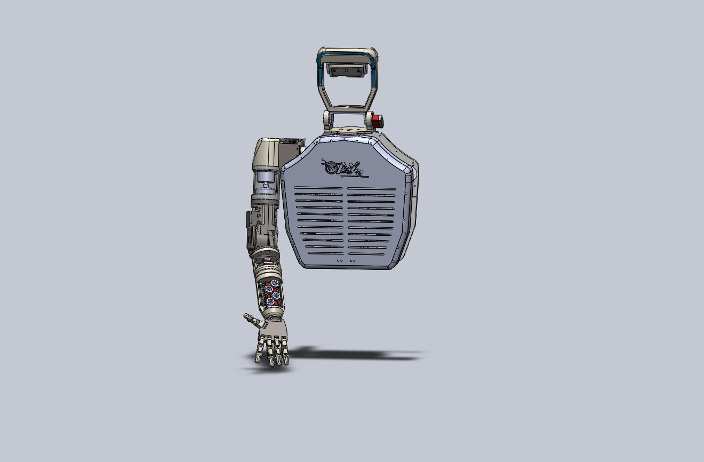
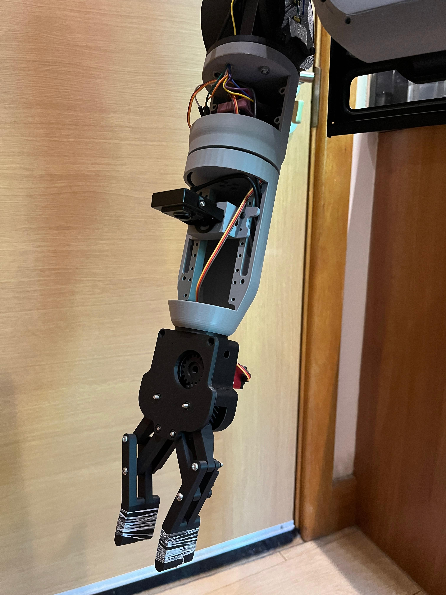

# Humanoid Agent Harness

An LLM agent harness for a configurable virtual robot world.

This project places an LLM-driven humanoid robot assistant inside a simple virtual environment where it can observe the world, request actions, and complete goal-directed tasks such as finding an object, picking it up, or placing it on a target surface.

The focus of the project is not the complexity of the world itself, but the interface between an intelligent agent and an environment it can act in.

The system uses my hosted **OAX-1B-Humanoid** language model through a Hugging Face Space API. The model proposes JSON tool calls, while a deterministic Controller validates or repairs those actions before the virtual world state is updated.

---

## Demo Video

A short demonstration video is available here:

[Watch the demo video](https://drive.google.com/file/d/1RxVhzRdtgY-IFzAmc1D7efbQyPrlYRvs/view?usp=drive_link)

The video demonstrates:

- entering a natural language goal,
- sending the structured observation to the hosted OAX LLM,
- receiving a JSON-style tool call,
- repairing invalid LLM actions through the Controller,
- updating the virtual world state,
- completing the task successfully.

---

## Background

This project is based on my larger OAX humanoid robot research prototype.

In the original robot project, I built a desktop humanoid robot system with:

- a custom 1B-parameter LLaMA-style language model,
- JSON-based robot tool calling,
- Planner and Controller validation layers,
- active vision and object search,
- pick, place, search, status, and visible-object behaviours,
- a humanoid robotic arm with camera-based perception and object interaction.

The original architecture followed this pattern:

```text
User command
→ LLM JSON response
→ Planner / Controller validation
→ Tool execution
→ Robot or environment state update
```

This challenge project adapts that idea into a lightweight virtual world so the agent harness can be tested clearly without requiring physical robot hardware.

---

## Related Physical Robot Prototype

This virtual agent harness is inspired by my physical OAX humanoid robot prototype, developed as my MSc Artificial Intelligence and Data Science final project.

The physical prototype was developed over approximately three months as an end-to-end robotics artefact. The work included mechanical design, 3D-printed structure, electronics, actuator integration, embedded control, computer vision, LLM-based decision-making, and system-level software integration.

The robot prototype combined:

- a desktop-scale humanoid robotic platform,
- a 5-DOF robotic arm with an end-effector/gripper,
- a camera-based perception system,
- object search and tracking behaviours,
- a custom 1B-parameter LLaMA-style language model,
- JSON-based robot tool calling,
- Planner and Controller validation layers,
- pick, place, search, and status behaviours.

The main idea behind the original system was to separate high-level language reasoning from low-level execution. The LLM generated structured tool calls, while deterministic validation layers checked whether each action was safe and valid before execution.

The virtual harness in this repository keeps the same core idea, but replaces the physical robot with a simple configurable virtual world. This makes the agent loop easier to run, inspect, and evaluate without requiring access to the physical hardware.

### Prototype Images


**3D Design**


**Front View**


**Head Mechanism**


**Gripper and Wrist**


---

## Virtual Agent Harness Architecture

This repository implements a simplified virtual version of the control structure used in my physical humanoid robot project.

The loop is:

```text
Natural language goal
→ Virtual world observation
→ Hosted OAX-1B-Humanoid LLM
→ JSON tool call
→ Controller validation / repair
→ Virtual world action execution
→ Updated virtual world state
```
---

## Key Idea

The LLM does not directly control the world.

Instead, the LLM proposes a JSON tool call. The Controller checks whether that tool call is valid for the current state. If the LLM selects the wrong tool, the Controller repairs the action before the World executes it.

Example:

```text
Goal: find the cup and pick it up

LLM: place_object(object=bottle, destination=table)
Controller: REPAIR | corrected LLM tool -> search_object(object=cup)
World: Agent searched for cup and moved to its location.
```

This demonstrates the main design principle:

```text
LLM output is not blindly trusted.
The Controller validates or repairs actions before state changes.
```

---

## Features

- Configurable virtual 2D world
- Natural language goal input
- Automatic task type detection
- Hosted LLM inference through Hugging Face Space API
- JSON tool-call action format
- Deterministic Controller validation and repair
- Compact readable logs
- Example batch runs with 20 mixed scenarios
- No local model download required for hosted inference

---

## Supported Task Types

The system automatically detects the task type from the user goal.

### 1. Find Only

Example goals:

```text
find the cup
locate the key
search for the screwdriver
where is the marker
```

The goal is complete when the target object is found and becomes reachable.

### 2. Find and Pick

Example goals:

```text
find the cup and pick it up
pick the phone
grab the medicine box
take the battery pack
```

The goal is complete when the target object is picked up.

### 3. Pick and Place

Example goals:

```text
pick the bottle and place it on the table
move the apple to the fruit basket
take the key and drop it into the box
pick up the charger and place it on the workbench
```

The goal is complete when the object is placed on the target location.

---

## Virtual World

The world is a simple 2D grid.

The agent always starts at:

```text
[0, 0]
```

The user provides the target object position and, when required, the target location position.

Example:

```text
What is the goal?: find the cup and pick it up
cup location x y (0-10): 4 8
```

The world automatically computes:

- object distance,
- reachability,
- inventory state,
- picked object state,
- goal completion.

Distance is calculated using Manhattan distance:

```text
distance = |agent_x - object_x| + |agent_y - object_y|
```

---

## Observation Format

The LLM receives a structured observation of the current world state.

Example simplified observation:

```json
{
  "goal": "find the cup and pick it up",
  "task_type": "find_and_pick",
  "agent": {
    "position": [0, 0],
    "inventory": []
  },
  "visible_objects": [
    {
      "id": "cup",
      "position": [4, 8],
      "distance": 12,
      "reachable": false,
      "held": false,
      "placed_on": null
    }
  ],
  "task_state": {
    "target_object": "cup",
    "target_location": null,
    "picked_object": null,
    "goal_completed": false
  },
  "available_tools": [
    "get_visible_objects",
    "get_robot_status",
    "search_object",
    "pick_object",
    "place_object",
    "stop"
  ]
}
```

The observation is the only world state passed to the LLM. The LLM does not directly access or update the environment.

---

## Action Space

The LLM can request one of the following tools:

| Tool | Purpose |
|---|---|
| `get_visible_objects` | Return visible objects in the world |
| `get_robot_status` | Return current agent status |
| `search_object` | Search for an object and move close enough to make it reachable |
| `pick_object` | Pick up a reachable object |
| `place_object` | Place a held object on a target location |
| `stop` | Stop when the goal is complete |

---

## LLM Output Format

The hosted model returns JSON-style tool calls.

Example:

```json
{
  "type": "tool_call",
  "response": "Searching for the cup.",
  "tool": "search_object",
  "arguments": {
    "object": "cup"
  }
}
```

The project normalises small schema deviations from the model, such as unexpected `type` values, before passing the action to the Controller.

---

## Hosted OAX-1B-Humanoid Model

This project uses my hosted OAX model:

```text
orhanaydinn/OAX-1B-Humanoid-Merged
```

The model is served through a Hugging Face Space API:

```text
orhanaydinn/oax-humanoid-agent-api
```

The reviewer does not need to download the model locally. The GitHub project sends the current observation to the hosted Space API and receives a JSON tool call.

The hosted model currently runs on CPU through Hugging Face Space. This may introduce some latency, especially during cold start. However, it keeps the reviewer-side setup lightweight and avoids requiring local GPU hardware or a large model download.

---

## Project Structure

```text
humanoid_agent_harness/
├── main.py
├── run_batch_examples.py
├── requirements.txt
├── README.md
├── agent/
│   ├── __init__.py
│   └── hf_agent.py
├── controller/
│   ├── __init__.py
│   └── controller.py
├── environment/
│   ├── __init__.py
│   └── world.py
├── examples/
│   └── successful_run.txt
└── assets/
    ├── architecture.png
    ├── oax_robot_front.jpg
    ├── oax_robot_arm.jpg
    └── demo_output.png
```

---

## Installation

Python 3.10 is recommended.

Clone the repository:

```bash
git clone REPOSITORY_URL_HERE
cd humanoid_agent_harness
```

Install dependencies:

```bash
pip install -r requirements.txt
```

The hosted mode uses:

```text
gradio_client
```

No local model download is required for the default hosted workflow.

---

## Run Interactive Demo

Run:

```bash
python main.py
```

Example input:

```text
What is the goal?: find the cup
cup location x y (0-10): 5 8
```

Example output:

```text
Humanoid Agent Harness Demo
============================================================
Goal: find the cup
Task type: find_only

Running step 1...

Step 1
------------------------------------------------------------
Before: agent=[0, 0] | inventory=[] | cup=pos[5, 8], dist=13, reachable=False
LLM: place_object(object=bottle, target=user)
Controller: REPAIR | corrected LLM tool -> search_object(object=cup)
World: Agent searched for cup and found it.
After: agent=[5, 8] | inventory=[] | cup=pos[5, 8], dist=0, reachable=True

Final result: SUCCESS - Goal completed.
```

The important point is that the LLM output is visible, but it is not executed blindly. The Controller repairs the invalid LLM action before the World updates its state.

---

## How to Read the Output

The program prints a compact step-by-step trace of the agent loop.

Each step contains five main lines:

```text
Before
LLM
Controller
World
After
```

### Before

The `Before` line shows the world state before the action is executed.

Example:

```text
Before: agent=[0, 0] | inventory=[] | cup=pos[5, 8], dist=13, reachable=False
```

This means:

- the agent is currently at position `[0, 0]`,
- the agent is not holding anything,
- the cup is located at `[5, 8]`,
- the cup is 13 grid steps away,
- the cup is not yet reachable.

### LLM

The `LLM` line shows the tool call proposed by the hosted OAX language model.

Example:

```text
LLM: place_object(object=bottle, target=user)
```

This may be correct or incorrect. The LLM output is intentionally not trusted directly.

### Controller

The `Controller` line shows the validated or repaired action.

Example:

```text
Controller: REPAIR | corrected LLM tool -> search_object(object=cup)
```

This means the LLM selected an invalid or premature action, so the Controller replaced it with a valid action.

If the LLM action is already valid, the output can show:

```text
Controller: EXECUTE | LLM tool accepted -> pick_object(object=cup)
```

### World

The `World` line shows what the environment actually executed.

Example:

```text
World: Agent searched for cup and found it.
```

This confirms that the environment state was updated by the Controller-approved action, not directly by the LLM.

### After

The `After` line shows the updated world state.

Example:

```text
After: agent=[5, 8] | inventory=[] | cup=pos[5, 8], dist=0, reachable=True
```

This means:

- the agent moved to the cup,
- the cup is now reachable,
- the find task can be completed.

---

## Example Output Explained

Example task:

```text
find the cup
```

Example trace:

```text
Step 1
------------------------------------------------------------
Before: agent=[0, 0] | inventory=[] | cup=pos[5, 8], dist=13, reachable=False
LLM: place_object(object=bottle, target=user)
Controller: REPAIR | corrected LLM tool -> search_object(object=cup)
World: Agent searched for cup and found it.
After: agent=[5, 8] | inventory=[] | cup=pos[5, 8], dist=0, reachable=True

Final result: SUCCESS - Goal completed.
```

In this example, the LLM proposed the wrong action. It attempted to place a bottle even though the task was to find a cup.

The Controller detected that the cup was not reachable and repaired the action into:

```text
search_object(object=cup)
```

The World then executed the repaired action, moved the agent to the cup, and marked the goal as complete.

This demonstrates the main purpose of the harness:

```text
The LLM can make imperfect decisions, but the Controller prevents invalid actions from directly changing the world.
```

---

## Run Batch Examples

To generate a larger example log:

```bash
python run_batch_examples.py
```

This runs 20 mixed scenarios:

- find-only tasks,
- find-and-pick tasks,
- pick-and-place tasks.

The output is saved to:

```text
examples/successful_run.txt
```

This file is included so reviewers can inspect a full run without waiting for every scenario to execute.

---

## Example Scenarios

The batch script includes goals such as:

```text
find the cup
locate the key
search for the screwdriver
find the bottle and pick it up
grab the medicine box
take the battery pack
pick the bottle and place it on the table
move the apple to the fruit basket
take the key and drop it into the box
pick up the charger and place it on the workbench
```

Each scenario uses different object and target coordinates.

---

## Example Run Screenshot

You can add a screenshot of a terminal run here:


---

## Why the Controller Matters

LLMs can produce plausible but invalid actions.

For example, the model may try to place an object before it has been picked up, or it may refer to the wrong object. The Controller prevents those actions from directly changing the world state.

Example:

```text
Goal: find the cup and pick it up

LLM requested:
place_object(object=bottle, destination=table)

Controller selected:
search_object(object=cup)

World result:
Agent searched for cup and moved to its location.
```

This pattern mirrors the safety structure used in the original humanoid robot project:

```text
LLM proposes
Controller validates or repairs
World executes only the validated action
```

---

## Design Choices

### Simple World, Strong Harness

The world is intentionally simple. The challenge focuses on the interface between the LLM and the environment, rather than graphics or complex physics.

### Structured Observation

The LLM receives structured state rather than raw text only. This makes the agent loop easier to inspect and debug.

### Tool-Based Actions

Actions are represented as tool calls, matching the structure used in the original humanoid robot system.

### Deterministic Validation

The Controller is deterministic and state-aware. It can repair invalid or premature LLM actions before execution.

### Hosted LLM Runtime

The model runs through a hosted Hugging Face Space API, so the reviewer does not need to download the model locally.

---

## Limitations

- The virtual world is grid-based and does not include physics.
- The hosted Space may have CPU latency or cold-start delay.
- The LLM can still produce incorrect tool calls.
- The Controller currently supports a small set of task types and tools.
- Real-world robot execution would require additional safety checks, perception validation, and motion planning.

---

## Future Work

Possible extensions include:

- adding obstacles and path planning,
- adding multi-room exploration,
- adding memory over multiple tasks,
- adding richer object attributes,
- adding simulated perception noise,
- deploying the model on a GPU-backed endpoint,
- adding a visual 2D or 3D frontend,
- adapting the same harness back to the physical OAX humanoid robot.

---

## Summary

This project demonstrates an LLM agent acting inside a virtual robot world.

The key contribution is the harness:

```text
Observation
→ Hosted OAX LLM
→ JSON tool call
→ Controller validation / repair
→ World execution
→ Updated observation
```

The result is a small but complete agent loop that shows how an LLM can interact with an environment through structured tools while remaining constrained by deterministic validation.
